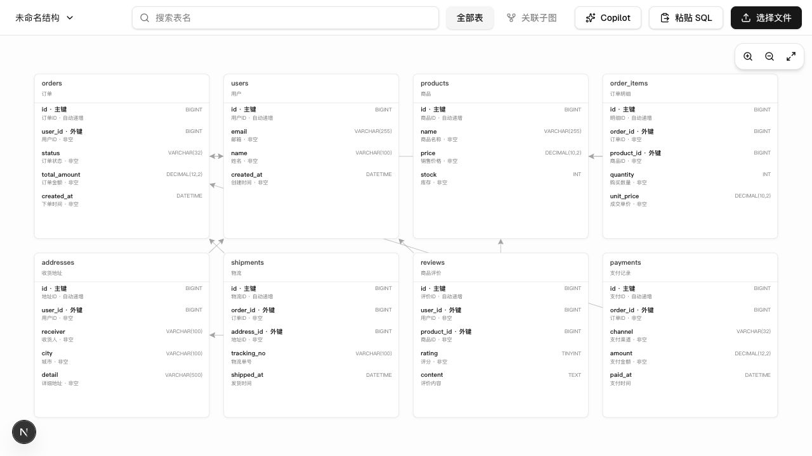
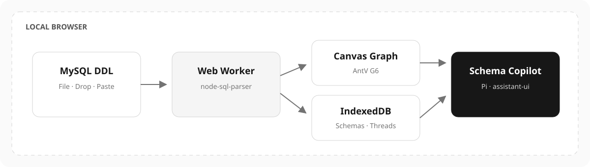

# Schema Atlas

[中文](README.md) · [English](README_EN.md)

面向大型 MySQL Schema 的本地可视化与 AI 分析工具。导入 DDL 后即可梳理表、字段、注释和外键关系；无需连接数据库，也不会执行 SQL。



## 特性

- 导入 `.sql` / `.txt`、拖放文件或直接粘贴 MySQL DDL
- 在 Web Worker 中解析，避免大文件阻塞主界面
- 识别字段、COMMENT、主键、索引、表内外键和 `ALTER TABLE` 外键
- 基于 AntV G6 Canvas 的关系画布，支持缩放、拖动、搜索和定位
- 固定高度表卡片，字段过多时在卡片内部滚动
- “关联子图”聚焦所选表的一层上下游，适合 2300+ 表的 Schema
- 多份 Schema 的导入、重命名、切换和删除
- 基于 Pi Agent Loop 与 assistant-ui 的 Schema Copilot
- AI 可按需搜索表、读取字段、分析关系、生成 SQL 并定位画布
- 每份 Schema 拥有独立的本地 AI 会话历史
- shadcn/ui 默认组件与 neutral 主题

## 本地优先

Schema Atlas 不连接数据库。DDL、解析结果和 AI 会话保存在浏览器 IndexedDB 中；模型配置保存在当前浏览器 localStorage 中。只有在使用 Copilot 时，相关 Schema 上下文才会发送到你配置的模型服务商。



## 技术栈

- Next.js 16、React 19、TypeScript、Tailwind CSS
- shadcn/ui、assistant-ui
- AntV G6
- `node-sql-parser` + Web Worker
- Pi Agent Loop
- IndexedDB

## 快速开始

要求：Node.js 20+。

无需安装，直接运行：

```bash
npx schema-atlas@latest
```

命令会自动选择可用端口、启动本地服务并打开浏览器。也可以全局安装：

```bash
npm install -g schema-atlas
schema-atlas
```

常用参数：

```bash
schema-atlas --port 4173
schema-atlas --host 0.0.0.0
schema-atlas --no-open
```

从源码开发：

```bash
git clone https://github.com/forrestsweet/schema-atlas.git
cd schema-atlas
npm install
npm run dev
```

打开终端中显示的本地地址，粘贴或选择一份 MySQL DDL 文件。

## Schema Copilot

打开右侧 Copilot，在模型设置中选择 Provider、模型并填写 API Key。支持 Pi 内置模型目录及自定义 OpenAI 兼容端点。

当前 AI 只读取导入的 DDL，不连接数据库、不执行 SQL，也无法访问真实业务数据。

## 大规模 Schema

项目提供测试数据生成脚本，本地生成的文件不会提交到 Git：

```bash
npm run generate:large-schema -- 2300 work/large-schema.sql
```

建议先通过搜索定位目标表，再使用“关联子图”缩小画布范围。

## 检查

```bash
npm run lint
npx tsc --noEmit
npm run build
```

## 数据清理

在结构下拉菜单中删除 Schema 时，会同时删除其 DDL、解析结果和对应的 AI 会话。模型配置可在浏览器站点数据中清除。

## 第三方组件

本项目组合了多个成熟的开源项目，详见 [THIRD_PARTY_NOTICES.md](THIRD_PARTY_NOTICES.md)。
